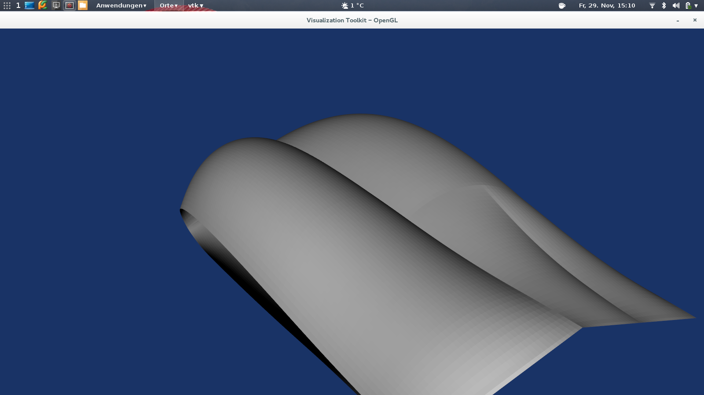
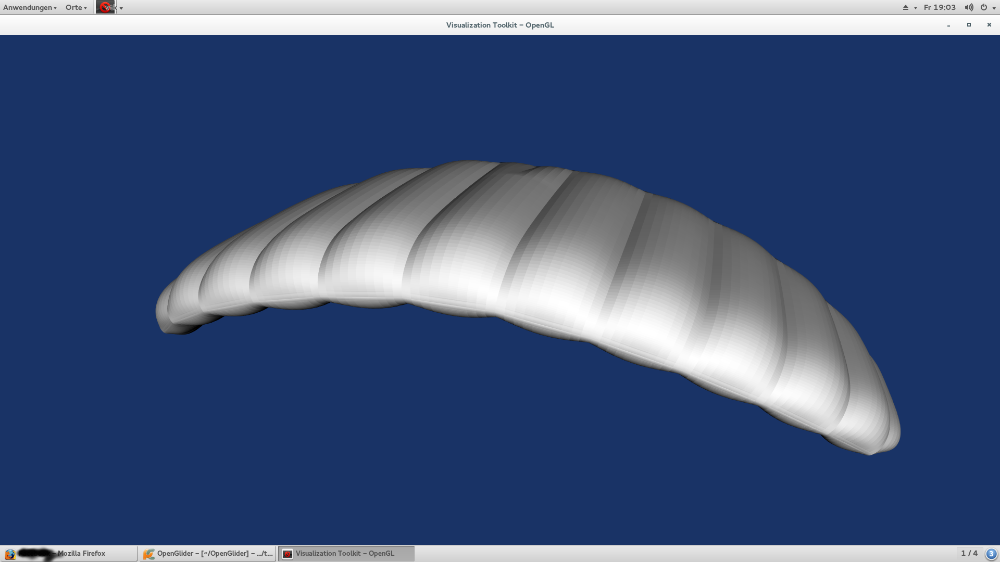
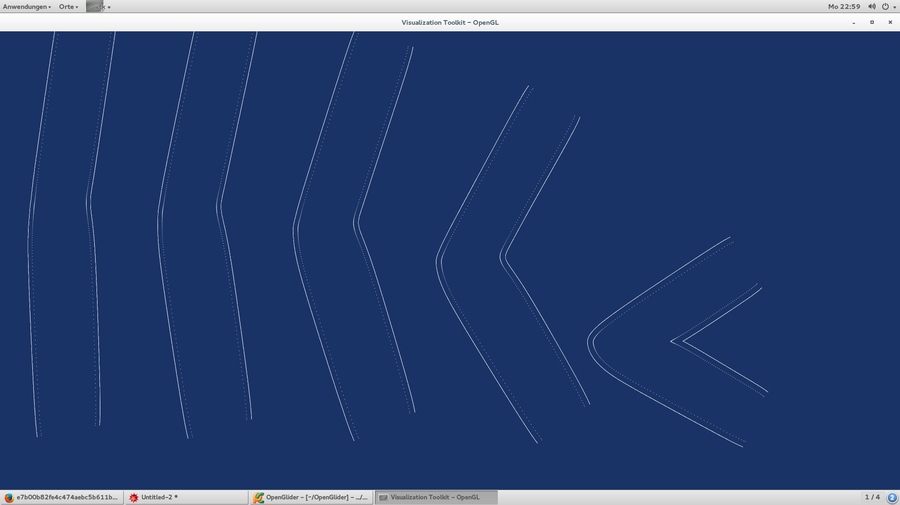

OpenGlider
==========

[](https://travis-ci.org/hiaselhans/OpenGlider)
[](https://readthedocs.org/projects/openglider/?badge=latest)

someday, hopefully this is open source paraglider design software


Try It
------

Clone the git-repo first:
  ```
  git clone https://github.com/hiaselhans/OpenGlider.git
  ```

Install all dependencies (using distro-repos, easy_install or pip)
* ezodf2
* dxfwrite
* scipy
* (svgwrite)
* (vtk)

If you want to permanently install link it to the python packages or install with setup.py

```
  python2 setup.py develop
```

we use python2 as vtk is not yet available for python3.


Unittests and Visual Tests
--------------------------

To run all unittests, run this from the main directory:
  ```
  ./testall.py
  ```

Or use -a to also run visual tests
```
./testall.py -a
```


Development Progress
--------------------

While still being in an early status, here is some little screenshots to see the progress:





The plan is to build on:

* python ( http://docs.python.org/2/tutorial/ )
* vtk (visual toolkit, for 3d-output: http://www.vtk.org/)
* freecad (Open-Source Cad, written in c++ with python API (www.freecadweb.org/)
* xfoil//Pyxfoil for 2D-foil calculation ( http://web.mit.edu/drela/Public/web/xfoil/ ) (http://www.python-science.org/project/pyxfoil)
* self-coded panelmethod (VSAERO) and/or apame implementation (http://www.3dpanelmethod.com/) for quick 3D-calculation
    -> https://github.com/hiaselhans/booyapan
* OpenFoam obj-file CFD export ( http://www.openfoam.com/)
* Code_Aster FEM export ( http://www.code-aster.org ) - maybe calculix as we've done already, but it does currently not support membrane elements)

It will take some time, if you want to help, feel free to do so!

Using some older code, we already created a few prototypes which can be seen on www.booya.at
