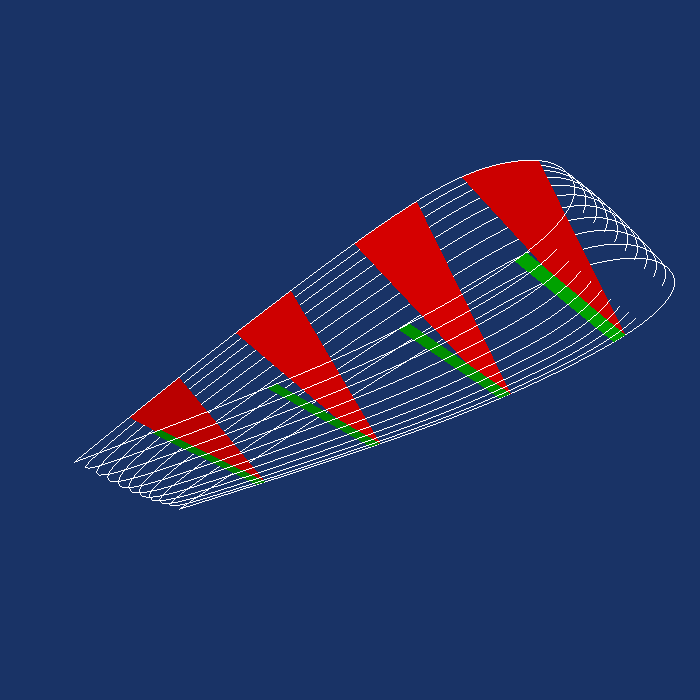

Cells
=====



A cell basically consists of two ribs plus a Ballooning.

```
import copy
import openglider
import openglider.glider as glider

b_upper = [[0, 0], [0.1, 0], [0.2, 0.14], [0.8, 0.14], [0.9, 0], [1, 0]]
b_lower = copy.copy(b_upper)
ballooning = glider.ballooning.BallooningBezier(b_upper, b_lower)
cell = glider.cell.Cell(rib1, rib2)

print(cell.area)

def get_thickness(y):
    prof3d = cell.midrib(y, ballooning=True)  # returns a airfoil3d
    prof2d = prof3d.flatten()
    return prof2d.thickness
    
print([get_thickness(y*0.1) for y in range(10)])
```

A cell's "left" side is its first rib (rib1)


Cell elements
-------------

Cells can contain any of the following objects:

* Panel
* DiagonalRib
* TensionStrap
* TensionStrapSimple (only a length is returned for plots)